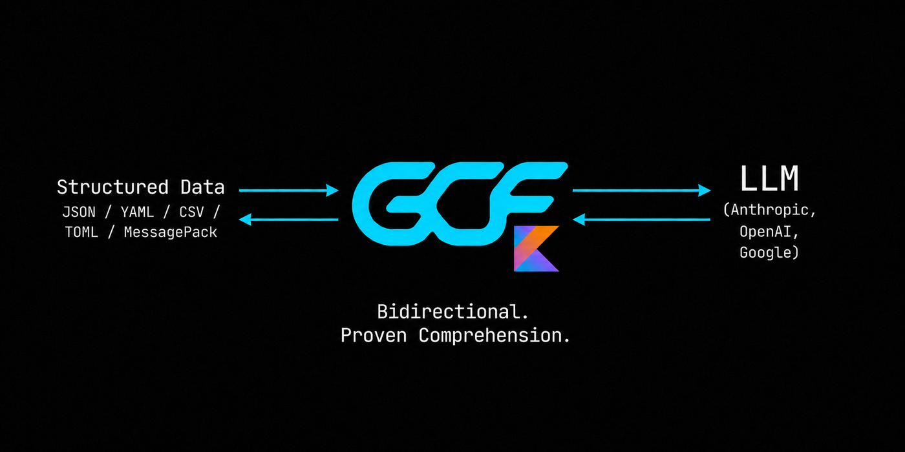

<p align="center">
  
</p>

<p align="center">
  <a href="https://github.com/blackwell-systems"></a>
  <a href="https://github.com/blackwell-systems/gcf-swift/actions"></a>
  <a href="LICENSE"></a>
</p>

# gcf-swift

Swift implementation of [GCF](https://gcformat.com/) -- the most token-efficient wire format for LLMs. A drop-in alternative to JSON and TOON for any structured data.

**100% comprehension on every frontier model tested. 29% fewer tokens than TOON, 56% fewer than JSON across 16 datasets. 91.2% on structurally complex code graphs (vs TOON 68.8%, JSON 54.1%). 2,400+ LLM evaluations. Zero training.**

Docs: [gcformat.com](https://gcformat.com/) · [Playground](https://gcformat.com/playground.html) · [GCF vs TOON](https://gcformat.com/guide/vs-toon.html)

## Install

Add to your `Package.swift`:

```swift
dependencies: [
    .package(url: "https://github.com/blackwell-systems/gcf-swift.git", from: "2.4.0"),
]
```

Then add `"GCF"` to your target's dependencies:

```swift
.target(name: "MyApp", dependencies: ["GCF"]),
```

Zero dependencies. Single module. Supports macOS 12+ and iOS 15+. Don't want to change code? Use the [MCP proxy](https://github.com/blackwell-systems/gcf-proxy) for zero-code adoption.

## Quick Start

```swift
import GCF

let output = encodeGeneric([
    "employees": [
        ["id": 1, "name": "Alice", "department": "Engineering", "salary": 95000],
        ["id": 2, "name": "Bob", "department": "Sales", "salary": 72000],
    ] as [[String: Any]]
])
```

Output:
```
## employees [2]{department,id,name,salary}
Engineering|1|Alice|95000
Sales|2|Bob|72000
```

## Graph Profile

```swift
let p = Payload(
    tool: "context_for_task", tokensUsed: 1847, tokenBudget: 5000,
    symbols: [
        Symbol(qualifiedName: "pkg.Auth", kind: "function", score: 0.78, provenance: "lsp", distance: 0),
        Symbol(qualifiedName: "pkg.Server", kind: "function", score: 0.54, provenance: "lsp", distance: 1),
    ],
    edges: [Edge(source: "pkg.Server", target: "pkg.Auth", edgeType: "calls")]
)
let output = encode(p)
```

Output:
```
GCF tool=context_for_task budget=5000 tokens=1847 symbols=2 edges=1
## targets
@0 fn pkg.Auth 0.78 lsp
## related
@1 fn pkg.Server 0.54 lsp
## edges [1]
@0<@1 calls
```

## Decode

```swift
let p = try decode(input)
print(p.tool, p.symbols.count, "symbols", p.edges.count, "edges")
```

## Session Deduplication

Track transmitted symbols across multiple tool responses. Previously-sent symbols become bare references instead of full declarations:

```swift
let session = Session()

let out1 = encodeWithSession(payload1, session: session) // full declarations
let out2 = encodeWithSession(payload2, session: session) // reused symbols as "@N  # previously transmitted"
```

By the 5th call in a session: 92.7% token savings vs JSON.

## Streaming Encode

Write GCF output incrementally as symbols and edges arrive. Zero buffering, O(1) memory per row:

```swift
let enc = StreamEncoder(writer: myWriter, tool: "context_for_task", options: StreamOptions(tokenBudget: 5000))

enc.writeSymbol(Symbol(qualifiedName: "pkg.Auth", kind: "function", score: 0.95, provenance: "lsp", distance: 0))
enc.writeEdge(Edge(source: "pkg.Server", target: "pkg.Auth", edgeType: "calls"))
enc.close()  // emits ##! summary trailer
```

Output uses `[?]` deferred counts and `##! summary` trailer. Standard `decode()` handles streaming output with no changes. Thread-safe via NSLock.

## Delta Encoding

When the consumer already has a prior context pack, send only what changed:

```swift
let delta = DeltaPayload(
    tool: "context_for_task",
    baseRoot: "aaa111",
    newRoot: "bbb222",
    removed: [Symbol(qualifiedName: "pkg.OldFunc", kind: "function")],
    added: [Symbol(qualifiedName: "pkg.NewFunc", kind: "function", score: 0.85, provenance: "rwr")],
    deltaTokens: 30,
    fullTokens: 200
)

let output = encodeDelta(delta)
```

81.2% savings on re-queries where the pack changed slightly.

## Generic Encoding

Encode any Swift value (not just graph payloads) into GCF tabular format:

```swift
let data: [String: Any] = [
    "employees": [
        ["id": 1, "name": "Alice", "department": "Engineering", "salary": 95000],
        ["id": 2, "name": "Bob", "department": "Sales", "salary": 72000],
    ] as [[String: Any]]
]
let output = encodeGeneric(data)
```

Output:
```
## employees [2]{department,id,name,salary}
Engineering|1|Alice|95000
Sales|2|Bob|72000
```

Works on dictionaries, arrays, and primitives. Arrays of uniform objects get tabular rows. Nested objects use `## key` section headers.

## Generic-Profile Delta (multi-turn)

In an agent loop the same keyed table gets re-queried turn after turn. Instead of re-sending the whole table each time, send only the changed rows (SPEC §10a):

```swift
import GCF

let base = GenericSet(key: "id", fields: ["id", "status"], rows: [
    ["id": 1001, "status": "pending"],
    ["id": 1002, "status": "shipped"],
])
let next = GenericSet(key: "id", fields: ["id", "status"], rows: [
    ["id": 1001, "status": "shipped"],   // changed
    ["id": 1003, "status": "pending"],   // added (1002 removed)
])

let d = try diffGenericSets(base, next)
let wire = encodeGenericDelta(d)                                   // ## added / ## changed / ## removed
let held = try verifyGenericDelta(base, d, expectedNewRoot: d.newRoot)  // atomic apply + new_root verification
```

Opt-in and bilateral, keyed on content-addressed pack roots. By the 5th overlapping call, ~97% fewer tokens than re-sending JSON. SHA-256 uses the platform `CryptoKit` framework (no package dependency added).

### Re-anchor session helper

`GenericDeltaSession` manages the delta/re-anchor cadence for you: each `next(_:)` returns either a compact delta or, on its cadence, a full re-anchor (which re-grounds the consumer), updating its held base.

```swift
let sess = GenericDeltaSession(base: base, tool: "orders", policy: .sizeGuard)
let full = sess.currentFull()                     // transmit the base once to establish it
for snapshot in stream {                          // each turn's current GenericSet
    let (wire, isFull) = try sess.next(snapshot)  // a compact delta, or a periodic full re-anchor
}
```

`ReanchorPolicy.fixed(15)` re-anchors every N turns (construct via `.fixed(_:)` so `n <= 0` clamps to `DEFAULT_REANCHOR_N` = 15); `.sizeGuard` (recommended) re-anchors once the cumulative delta reaches a full payload's size. It introduces no new wire syntax and the decoder stays cadence-agnostic, so a re-anchor is just the protocol's "full" outcome on a schedule.

## API

| Function | Description |
|----------|-------------|
| `encode(_ payload: Payload) -> String` | Encode a graph payload to GCF text |
| `encodeGeneric(_ data: Any?) -> String` | Encode any value to GCF tabular format |
| `decode(_ input: String) throws -> Payload` | Parse GCF text back to a Payload |
| `encodeWithSession(_ payload: Payload, session: Session?) -> String` | Encode with session deduplication |
| `encodeDelta(_ delta: DeltaPayload) -> String` | Encode a graph delta (added/removed only) |
| `diffGenericSets(_ base: GenericSet, _ next: GenericSet) throws -> GenericDeltaPayload` | Diff two keyed record sets (generic profile) |
| `encodeGenericDelta(_ d: GenericDeltaPayload) -> String` / `decodeGenericDelta(_ text: String) throws` | Generic-profile delta wire (§10a) |
| `verifyGenericDelta(_ base: GenericSet, _ d: GenericDeltaPayload, expectedNewRoot: String) throws -> GenericSet` | Atomic apply + `new_root` verification |
| `GenericDeltaSession(base:tool:policy:)` | Producer-side re-anchor cadence helper (§10a.8) |
| `Session()` | Create a new session tracker (thread-safe) |

## Types

| Type | Purpose |
|------|---------|
| `Payload` | Full GCF payload: tool, budget, symbols, edges, pack root |
| `Symbol` | Graph node: qualified name, kind, score, provenance, distance |
| `Edge` | Directed relationship: source, target, edge type |
| `DeltaPayload` | Diff between two graph packs: added/removed symbols and edges |
| `GenericSet` / `GenericDeltaPayload` | Keyed record set and its generic-profile diff (§10a) |
| `GenericDeltaSession` | Stateful producer that schedules delta vs full re-anchor (§10a.8) |
| `Session` | Thread-safe tracker for multi-call deduplication |
| `kindAbbrev` / `kindExpand` | Bidirectional kind abbreviation maps |

## Benchmarks

2,400+ LLM evaluations across 10 models, 3 providers, and 51 independent test runs.

| | GCF | TOON | JSON |
|---|---|---|---|
| **Comprehension** (23 runs, 10 models) | **91.2%** | 68.8% | 54.1% |
| **Generation** (28 runs, 9 models) | **5/5** | 1.0/5 | 5.0/5 |
| **Input tokens** (500 symbols) | **11,090** | 16,378 | 53,341 |
| **Output tokens** (100 symbols) | **5,976** | 8,937 | 16,121 |

GCF wins 15/16 datasets on the expanded [token efficiency benchmark](https://github.com/blackwell-systems/toon/tree/gcf-comparison). Full results: [gcformat.com/guide/benchmarks](https://gcformat.com/guide/benchmarks.html)

## Implementations

| Language | Package | Repository |
|----------|---------|-----------|
| Go | `go get github.com/blackwell-systems/gcf-go` | [gcf-go](https://github.com/blackwell-systems/gcf-go) |
| TypeScript | `npm install @blackwell-systems/gcf` | [gcf-typescript](https://github.com/blackwell-systems/gcf-typescript) |
| Python | `pip install gcf-python` | [gcf-python](https://github.com/blackwell-systems/gcf-python) |
| Rust | `cargo add gcf` | [gcf-rust](https://github.com/blackwell-systems/gcf-rust) |
| Swift | Swift Package Manager | [gcf-swift](https://github.com/blackwell-systems/gcf-swift) |
| Kotlin | JitPack | [gcf-kotlin](https://github.com/blackwell-systems/gcf-kotlin) |
| MCP Proxy | `pip install gcf-proxy` | [gcf-proxy](https://github.com/blackwell-systems/gcf-proxy) (bidirectional, session dedup, HTTP frontend) |
| Claude Code Plugin | `/plugin install` | [gcf-claude-plugin](https://github.com/blackwell-systems/gcf-claude-plugin) (one-command install, session stats hook) |
| Codex Plugin | `codex plugin add` | [gcf-codex-plugin](https://github.com/blackwell-systems/gcf-codex-plugin) (one-command install, session stats hook) |
| VS Code | `ext install blackwell-systems.gcf-vscode` | [gcf-vscode](https://marketplace.visualstudio.com/items?itemName=blackwell-systems.gcf-vscode) (syntax highlighting) |
| n8n | `npm install n8n-nodes-gcf` | [gcf-n8n-nodes](https://github.com/blackwell-systems/gcf-n8n-nodes) (workflow encode/decode) |
| Tree-sitter | `npm install tree-sitter-gcf` | [tree-sitter-gcf](https://github.com/blackwell-systems/tree-sitter-gcf) |

**Zero runtime dependencies. Permanently.** All six implementations depend only on their language's standard library. No transitive dependencies. No supply chain risk. This is a permanent commitment: GCF will never take on external runtime dependencies. MIT licensed. All implementations support both generic profile (`encodeGeneric`) and graph profile (`encode`). CLI included in all 6 languages.

**Specification:** [SPEC v3.4.1 Stable](https://github.com/blackwell-systems/gcf/blob/main/SPEC.md) with 204 conformance fixtures, 43,000,000,000+ lossless round-trips verified across 5 formats and 6 languages. All implementations at v2.4.0+ (Go v1.5.0). Cross-language 6x6 matrix verified.

## Adopted by

[Chrome DevTools MCP](https://github.com/ChromeDevTools/chrome-devtools-mcp) (46K stars, Google Chrome DevTools team) · [Speakeasy](https://speakeasy.com) (API tooling, customers include Google, Verizon, Mistral AI, DocuSign, Vercel) · [OmniRoute](https://omniroute.online) (6.1K stars) · [NetClaw](https://github.com/automateyournetwork/netclaw) (556 stars) · [ctx](https://github.com/stevesolun/ctx) (510 stars) · [NeuroNest](https://neuronest.cc) · [Open Data Products SDK](https://opendataproducts.org/sdk/) (Linux Foundation) · [Raycast](https://raycast.com/blackwell-systems/json-to-gcf-converter) · [and more](https://gcformat.com/ecosystem/adopters.html)

## License

MIT - [Dayna Blackwell](https://github.com/blackwell-systems)
